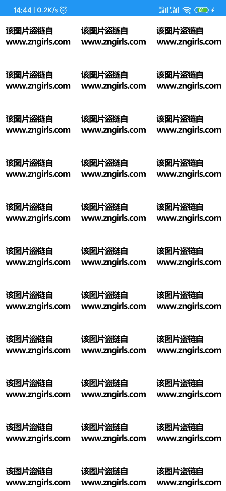

# BeautifulGirl
爬了[宅男女神网](https://m.nvshens.org/gallery/)的地址做的一个看美女的APP

## 功能
* 就是爬了一些图片而已，自我欣赏来的。
* 原网站广告有点多，所以索性自己爬一下做了一个简单的APP。
* 把原网站的一些逻辑做了修改，不需要再重复点击下一页下一页什么的。
* 暂时没有设置图片张数上限，估计到时候被检测到的话，可能会被封掉。
* 之前也爬过宅男女神，但是后面看图片提示说检测到非法获取，最近试了一下下好像又可以了。
* 主要技术是[jsoup](https://www.open-open.com/jsoup/),感谢开源。

## 下载地址
 [下载地址](/app/release/app-release.apk)

## 截图

   &nbsp;&nbsp;
   &nbsp;&nbsp;

2020年02月27日更新
是的，很惨，昨天打开软件发现满屏的盗链提示，官方又开始检测盗链了，因此这个项目可能要废弃了。现在也没有过多地时间去研究这种盗链的解决方法，就先这样吧。 
   &nbsp;&nbsp;

2020年12月27日更新

顺带更新了一些lib包

通过addHeader("Referer", nvshensUrl)的方式貌似解决了盗链的问题，能加载图片了。如图

   &nbsp;&nbsp;

## 感谢
* [Jsoup](https://jsoup.org/)
* [AndroidUtilCode](https://github.com/Blankj/AndroidUtilCode/blob/master/lib/utilcode/README-CN.md)
* [PhotoView](https://github.com/chrisbanes/PhotoView)
* [Glide](https://github.com/bumptech/glide)
* [SmartRefreshLayout](https://github.com/scwang90/SmartRefreshLayout/tree/androidx)
* [BaseRecyclerViewAdapterHelper](https://github.com/CymChad/BaseRecyclerViewAdapterHelper/tree/androidx)
* [Coroutines](https://github.com/Kotlin/kotlinx.coroutines)

